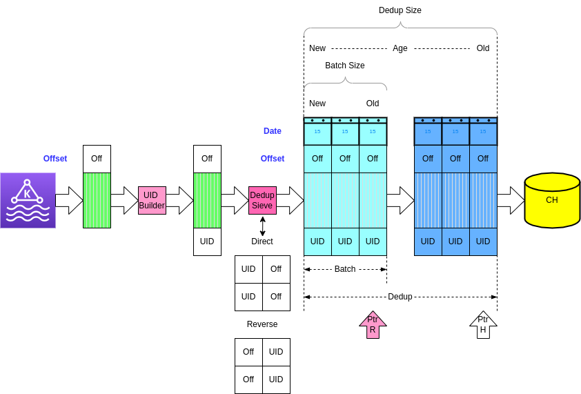

# Architecture

## DeDuplicator

**Assumption**: each table has to have a **Deduplication key** specified. 
Deduplication key is a set of fields, explicitly specified to be used as a basis for deduplication.
In case PK is defined it is natural to use PK as Deduplication Key as well, It is not mandatory, however, and for tables
without PK, Deduplication key is still required.

Connector maintains a map (Deduplication Map), where the key is a Deduplication key and the value is the record itself. 
As soon as a new record with the same Deduplication key arrives, it either replaces the existing record 
in the Deduplication Map or is dropped, based on the **Deduplication Policy**. Records from the Deduplication Map are 
formed into a Batch and are flushed into the ClickHouse on either time or size-based **Dump Policy**.

> **NB** it should be noted, that time-based batch flush can not form the same batches upon replay.

Flushed rows are removed from the Deduplication Map based on either time or size-based **Clear Policy**

As a result of the Deduplication Map application, connector has a set of records, which are de-duplicated within 
a certain time or size - limited window of records.

## Exactly Once Semantics

Exactly once semantics are guaranteed by storing offsets(by topic, partition) in a separate 
clickhouse table. The table will be ordered by time and a materialized view will be created as a 
cache to avoid expensive table scans.

Topic management will be disabled in Kafka connect and the `precommit()` function in 
SinkTask would return the offsets stored in clickhouse.

References:
[1] https://stackoverflow.com/questions/55608325/clickhouse-select-last-record-without-max-on-all-table